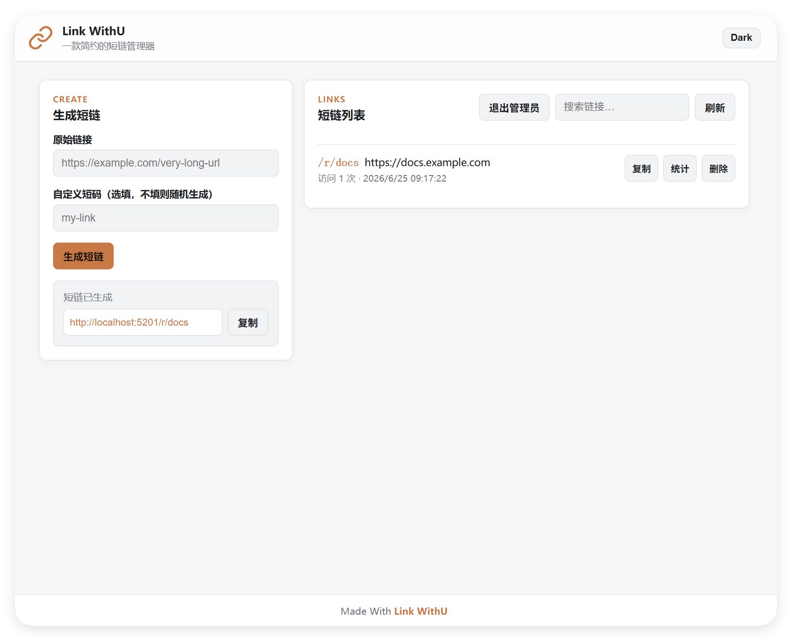

<h1 align="center">Link WithU</h1>

<p align="center">
  <strong>
    一款简约的短链管理器
  </strong>
</p>

<p align="center">
  <a href="https://hub.docker.com/r/xwithu/link-withu/tags">
    
  </a>
</p>

<p align="center">
  <a href="#快速开始"><strong>快速开始</strong></a>
  &middot;
  <a href="./docs/user-manual.md"><strong>用户手册</strong></a>
  &middot;
  <a href="./docs/dev-manual.md"><strong>参与贡献</strong></a>
</p>

<p align="center">
  <picture>
    <source media="(prefers-color-scheme: dark)" srcset=".github/assets/link-withu-dark.png">
    <source media="(prefers-color-scheme: light)" srcset=".github/assets/link-withu.png">
    
  </picture>
</p>

## 快速开始

基于 Docker 部署：

```bash
docker run -d \
  --name link-withu \
  -p 5201:5201 \
  -e ADMIN_PASSWORD='<your_password>' \
  -e BASE_URL='<your_server_ip>' \
  -v ./data:/proj/data \
  xwithu/link-withu:latest
```

基于 Docker Compose 部署：

```bash
# 下载 docker-compose.yml 文件
wget https://raw.githubusercontent.com/Explorer-Dong/link-withu/refs/heads/main/docker-compose.yml

# 下载并配置环境变量
wget https://raw.githubusercontent.com/Explorer-Dong/link-withu/refs/heads/main/.env.example -O .env
# 配置密码、域名等参数

# 启动 Link Withu
docker compose up -d
```

阅读 [用户手册](./docs/user-manual.md) 作进一步了解。

## 参与贡献

阅读 [开发手册](./docs/dev-manual.md) 作进一步了解。

## 开源协议

[MIT](./LICENSE)
